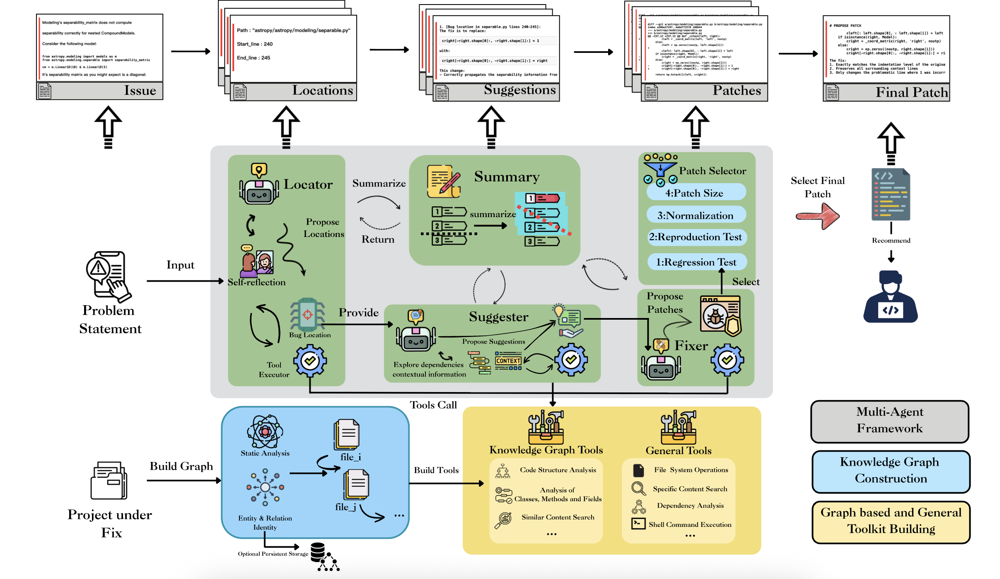

 
[**Technical Report**](https://ise-agent.github.io/fix-agent-home/)

# SGAgent

**SGAgent** is a repository-level software repair agent designed to bridge the gap between fault localization and patch generation.

While Large Language Models (LLMs) have shown great promise in software engineering, existing "localize-then-fix" paradigms often struggle with real-world repository complexities (e.g., SWE-Bench). They suffer from objective mismatches and missing intermediate planning, leading to overfitting and superficial fixes.

To address these limitations, **SGAgent** introduces an explicit **planning and suggestion phase**. By reasoning about *why* and *how* to modify the codebase before applying edits, it ensures more reliable, interpretable, and context-aware software repairs, effectively handling the dependencies inherent in large-scale software development.

  

## Demo

*Note: This demo illustrates an early prototype of the system and is currently under active development. It does not fully represent the final version.*

  <video src="statics/demo.mov" controls="controls" width="100%">
    Your browser does not support the video tag.
  </video>

## Configuration

You can configure SGAgent by modifying [`settings.py`](settings.py) or by setting environment variables. The system supports reading from a `.env` file.

### Environment Variables

Key configurations include:

- `API_KEY`: Your API key for the LLM.
- `BASE_URL`: Base URL for the LLM API.
- `MODEL`: The model name to use.
- `INSTANCE_ID`: The benchmark instance ID to run.
- `DATASET`: Dataset to use (default: `lite`).

## Note
This open-source project is specifically targeted at the SWE-bench dataset. Generalized capabilities have not yet been open-sourced.
